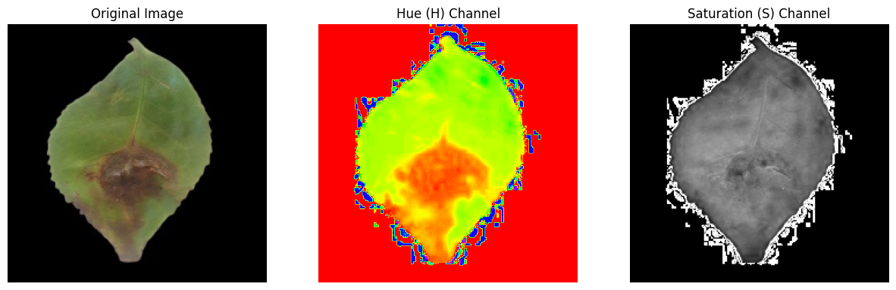
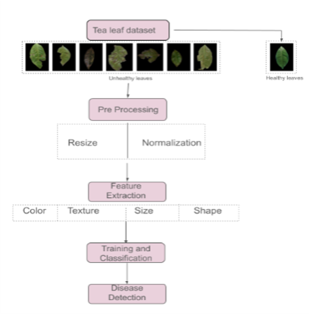
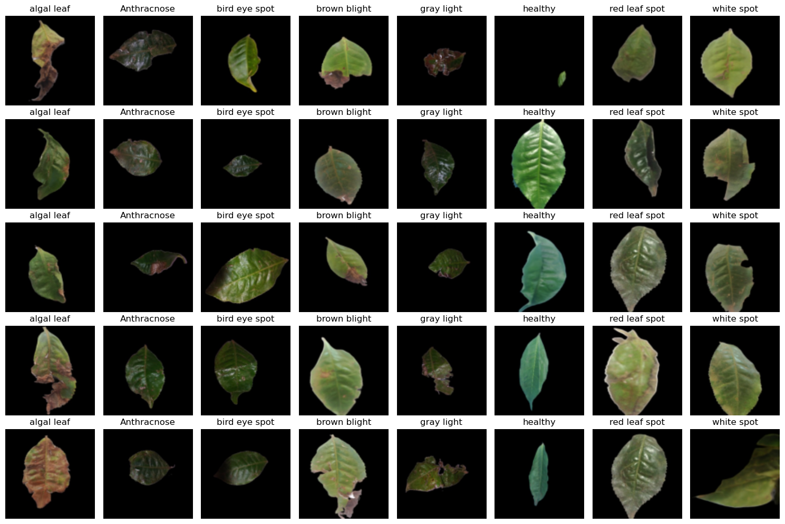

# tea-leaf-disease-detection-ml
Machine Learning-based tea leaf disease detection using image processing and feature extraction (Springer publication)
# Tea Leaf Disease Detection using Machine Learning

This project presents a machine learning-based approach for detecting tea leaf diseases using image processing and feature extraction techniques. The work is based on our Springer conference publication.

## 📄 Publication
**Title:** An Empirical Study on Tea Leaf Disease Detection Using Diverse Leaf Image Features  
**Conference:** Springer - Soft Computing: Theories and Applications (2025)  
🔗 [Read Paper (DOI)](https://doi.org/10.1007/978-981-96-5958-6_46)

## 🚀 Project Overview
The system detects and classifies tea leaf diseases using extracted features such as:
- Color (HSV channels)
- Texture (Local Binary Patterns - LBP)
- Shape and size features

## 🧠 Methodology
1. Image Preprocessing (resizing, normalization, noise removal)
2. Feature Extraction:
   - Color features (Hue, Saturation)
   - Texture features (LBP)
   - Shape and size metrics
3. Model Training using Machine Learning algorithms (Random Forest, SVM)
4. Disease Classification (Healthy vs Diseased)

## 📊 Results
- Successfully classified multiple tea leaf diseases
- Achieved strong performance using feature-based ML models
- Demonstrated effectiveness in agricultural disease detection

## 📂 Dataset
Dataset sourced from Kaggle:
📊 [Kaggle Tea Leaf Dataset](https://www.kaggle.com/datasets/shashwatwork/identifying-disease-in-tea-leafs)

## 🛠 Tech Stack
- Python
- OpenCV
- Scikit-learn
- NumPy, Pandas, Matplotlib

## 💻 Code
- Jupyter Notebook: `tea_leaf_detection.ipynb`
- Python Script: `main.py`

The notebook contains preprocessing, feature extraction, and model training steps.

## 📸 Sample Results
, , , , 

## 📁 Repository Structure
project/
│── data/
│── notebooks/
│── src/
│── results/
│── paper.pdf

## 🔗 Future Work
- Integration with deep learning models (CNN)
- Real-time deployment on mobile/edge devices
- Expansion to multiple plant species
